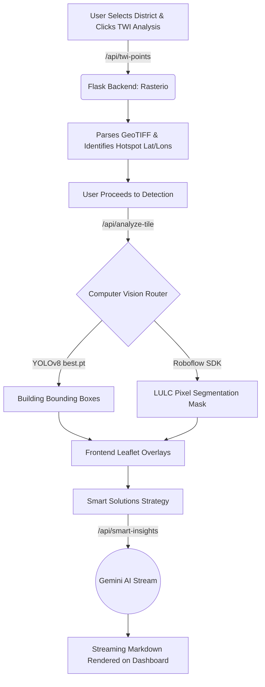

# 🌊 Sponge City Karachi: AI-Powered Urban Flood Intelligence

[]()
[]()
[]()
[]()

**Sponge City Karachi** is a state-of-the-art interactive geospatial and AI-driven platform. It was explicitly engineered to tackle recurring urban flooding in Karachi, Pakistan by implementing "Sponge City" principles—infrastructure designed to absorb, store, and reuse stormwater naturally.

This repository serves as both the **application source code** and the **master context blueprint** for any Developer or AI Assistant working on the system.

---

## 💧 Core Concept: Topographic Wetness Index (TWI)

At the heart of the platform's geospatial intelligence lies the calculation and visualization of the Topographic Wetness Index.

> *"The Topographic Wetness Index (TWI), also known as the Compound Topographic Index (CTI), is a steady-state hydrological model used to quantify topographic control on soil moisture and runoff accumulation. It identifies likely wet areas based on slope and upslope contributing area."* — [Wikipedia]

### Key Aspects of TWI:
* **Formula**: `TWI = ln(a / tan(β))`, where `a` is the upstream contributing area per unit width orthogonal to the flow direction, and `β` is the local slope.
* **Interpretation**: High TWI values indicate flatter areas with large contributing areas (highly likely to experience wetness, ponding, or urban flooding), while low values indicate steep, dry ridges.
* **Applications**: Extensively used in hydrology, urban planning, and ecological studies to map potential soil moisture distribution, plan wetlands, and formulate drainage networks.
* **Calculation Environment**: Computed through Geographic Information Systems (GIS) utilizing Digital Elevation Models (DEMs). In our system, TWI outputs are rasterized into GeoTIFFs and dynamically queried by the robust Flask backend to extract the exact geographical "hotspots" in the city.

---

## 🚀 The System: Architecture & Modules

Sponge City Karachi utilizes a decoupled **Three-Tier Architecture** (Data, Processing, Presentation) delivering five highly intelligent modules:

### 🧩 1. The 5 Core Modules
1. **Visualization (Map Exploration):** Renders highly detailed Shapefiles mapping Land Use, natural features, waterways, and places of worship in Karachi using Leaflet.
2. **TWI Analysis (Flood-Prone Spots):** Dynamically partitions districts into parameterized patches, pinpointing coordinates with maximum TWI risk (hotspots). 
   * *Developer Note:* Configuration fields (`Number of Patches`, `Min Distance`) are natively hidden from users for UI simplicity, but can be unlocked by double-clicking the **TWI Analysis** header.
3. **Detection Pipeline (Satellite CV):** Seamlessly stitches satellite imagery from ESRI and processes it through **YOLOv8 (Building Density)** and **Roboflow (LULC Segmentation)**. It automatically overlays object boundary boxes and segmentation masks to evaluate built-environment density at hotspots.
4. **Climate Insights (25-Year Data):** Explores a quarter-century of meteorological records (2000-2025) via a fully responsive, grid-based dashboard using Recharts. Included is a **Floating Glassmorphism AI Consultant** capable of retrieving weather metrics and answering localized climate queries.
5. **Smart Solutions Engine (AI Recommendations):** Combines the contextual snapshot (Elevation, Soil Type, TWI max, Building Density) into a meticulously crafted prompt sent to **Gemini 2.5 Flash**. The LLM generates structurally rich Markdown reports recommending precise green interventions (e.g., Bioswales, Retention basins) via Server-Sent Events (SSE) streaming. Responses are cached locally to `smart_insights.json`.

---

## ⚙️ Data Flow & Request Lifecycle



### Critical API Endpoints 
| Endpoint | Purpose | Core Technology | Output |
|----------|---------|-----------------|--------|
| `/api/twi-points` | TWI sampling and hotspot discovery | `rasterio`, GeoTIFF arrays | Grid-based TWI statistics and patch endpoints |
| `/api/analyze-tile` | LULC segmentation & Building detection | `ultralytics`, Roboflow SDK | Color-coded masks and bounding boxes |
| `/api/climate-stats` | 25-Year historical meteorological data | JSON Parsing | Full scale `kpis`, `monthly` and `yearly` statistics |
| `/api/smart-insights`| Analyzes hotspots for green interventions | Gemini 2.5 Flash | Server-Sent Event (SSE) Stream of Markdown Text |
| `/api/forecast` | Generates a 16-day dynamic forecast | Weather API | Categorized daily weather projections array |

---

## 📂 Complete Project Structure

```
FYP-2-Sponge-City-Karachi/
├── backend/
│   ├── app.py                     # Main Flask server & API routes
│   ├── requirements.txt           # Python dependencies
│   ├── analyze_twi.py             # TWI computations and GeoTIFF sampling
│   ├── detect_stats.py            # Aggregator for YOLO/Roboflow statistics
│   ├── get_coord.py               # Satellite tile mathematical routing
│   ├── smart_insights.json        # Cached AI Solutions (Gemini Output)
│   ├── data/
│   │   ├── Korangi_TWI.tif        # Spatial intelligence Topographic Wetness raster
│   │   └── climate_data_generated.json
│   ├── models/
│   │   └── best.pt                # Custom trained YOLOv8 model weights
│   └── sat_cache/                 # Reusable ESRI Satellite chunks
│
├── frontend/
│   ├── src/
│   │   ├── App.jsx                # Layout Shell & React Router Base
│   │   ├── index.css              # PostCSS / Tailwind configurations
│   │   └── components/
│   │       ├── Dashboard.jsx        # Root Orchestrator
│   │       ├── MapViewer.jsx        # React-Leaflet Map component
│   │       ├── Sidebar.jsx          # Route Navigation
│   │       ├── ClimateDashboard.jsx # Extensive Climate Intelligence UI
│   │       ├── SmartInsightsTab.jsx # Gemini LLM Markdown visualizer
│   │       ├── TwiAnalysisTab.jsx   # TWI map and controls
│   │       └── ...
│   ├── public/
│   │   ├── Layers/                # System Shapefiles (.shp, .shx, .dbf)
│   ├── package.json
│   └── vite.config.js
└── README.md                      # Architecture Blueprint
```

---

## 🎨 Geospatial Data Reference & Colors

### Available Shapefiles (Korangi District)
- `korangi_landuse.shp`: Land use classification
- `korangi_natural.shp`: Natural features
- `korangi_pois.shp`: Points of interest
- `korangi_roads.shp`: Road networks
- `korangi_water.shp`: Water bodies
- `new_korangi.shp`: Corrected district boundaries

### LULC Segmentation Legend (Roboflow Overlay)
| Class | Colors | Meaning |
|-------|--------|---------|
| Road | Purple | Paved roads and highways |
| Land | Brown | Bare ground / sandy plains |
| Park | Green | Designated recreation zones |
| Vegetation | Dark Green | Trees, heavy shrubs, forests |
| River | Blue | Flowing water |
| Water | Light Blue | Stationary bodies, shorelines |

---

## 💻 Developer Guide & Local Ecosystem

### Backend Setup (Terminal 1)
```bash
cd backend
python -m venv venv
# Windows: venv\Scripts\activate.ps1
# Mac/Linux: source venv/bin/activate
pip install -r requirements.txt
python app.py
```
*Backend runs on `http://localhost:5000` with extensive Flask-CORS to support front-end fetching.*

### Frontend Setup (Terminal 2)
```bash
cd frontend
npm install
npm run dev
```
*Frontend runs on `http://localhost:5173` via Vite Hot Module Replacement (HMR).*

---

## 🤖 Context For AI Models (Instructions for future LLMs)

If you are an AI reading this to assist the developer, abide strictly by the following environment constraints:

1. **State Orchestration**: The application is highly contextual. A vast amount of state operates at the `Dashboard.jsx` higher-order component (e.g. `selectedDistrict`, `twiData`), and passes downward to tabs.
2. **Streaming AI Interfaces**: Both the **Climate Chat** (`ClimateDashboard`) and the **Smart Solutions Generators** (`SmartInsightsTab`) utilize Server-Sent Events executing through `res.body.getReader()`. **Do not break or modify these stream read loops without careful validation.**
3. **Data Localization**: Leaflet maps are explicitly tethered to Karachi. The default anchor is `[24.84, 67.14]`. Calculations must reflect Web Mercator mathematical translations relative to this location.
4. **UI/UX Directives**: This application operates on an **extremely premium, dark-mode aesthetic.** 
   * **Do not use generic styles.** 
   * Prioritize Tailwind `backdrop-blur-*` elements (Glassmorphism).
   * Employ intricate gradients (`from-blue-600 to-indigo-600`), customized scrollbars (`custom-scrollbar`), absolute positioned floating panels, and smooth micro-animations. 
5. **Secret Developer Tools / Toggles**: Configurations strictly meant for developers (such as the `Number of Patches` limit configuration inside `TwiAnalysisTab.jsx`) are hidden natively and can only be presented via `onDoubleClick` of title texts. **Do not remove these developer Easter eggs.**

---

### Future Enhancements Pipeline
- [ ] Implement WebSocket-based live telemetry on the Visualization Map.
- [ ] Add PDF Report Generation of the AI Smart Strategies for urban planners.
- [ ] Develop historical 3D terrain comparisons spanning seasonal monsoon patterns.
- [ ] Include user authentication for caching project milestones.

*Built to transform cities. Prepared for a resilient future.*
